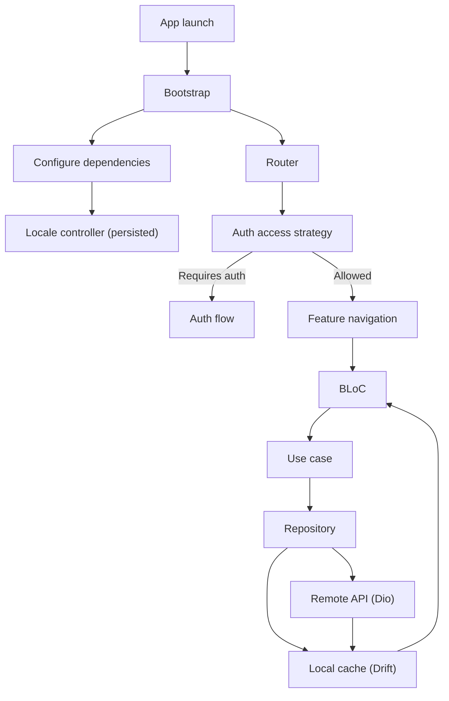
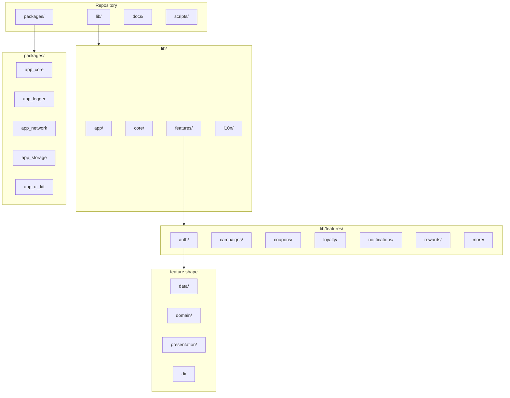
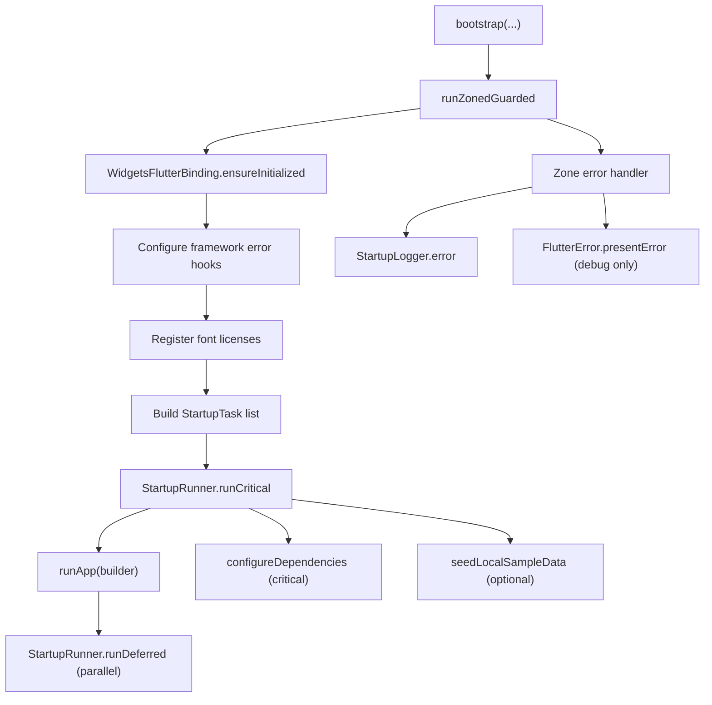
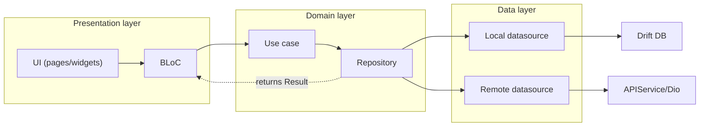
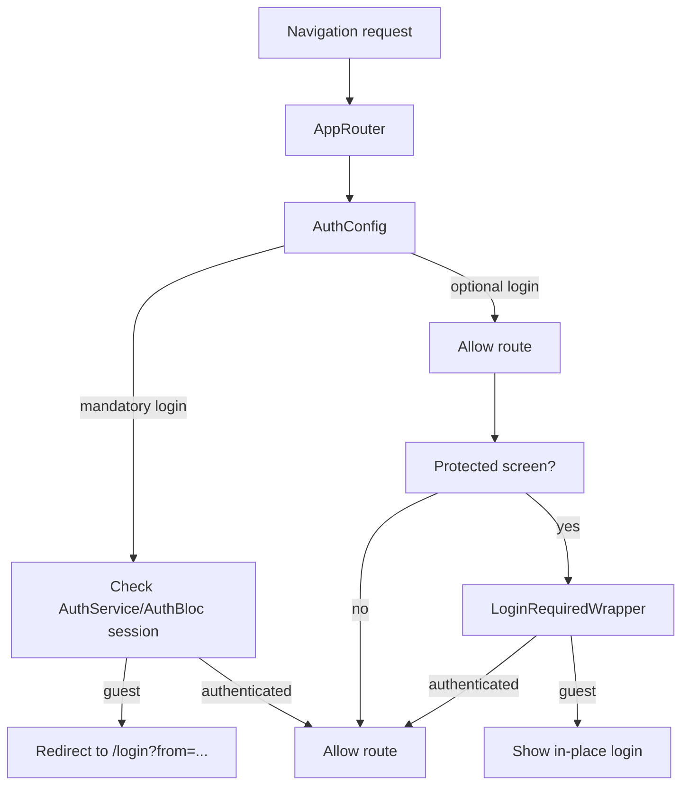
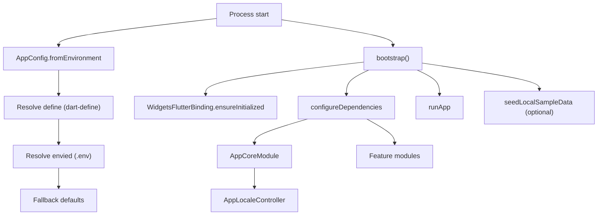
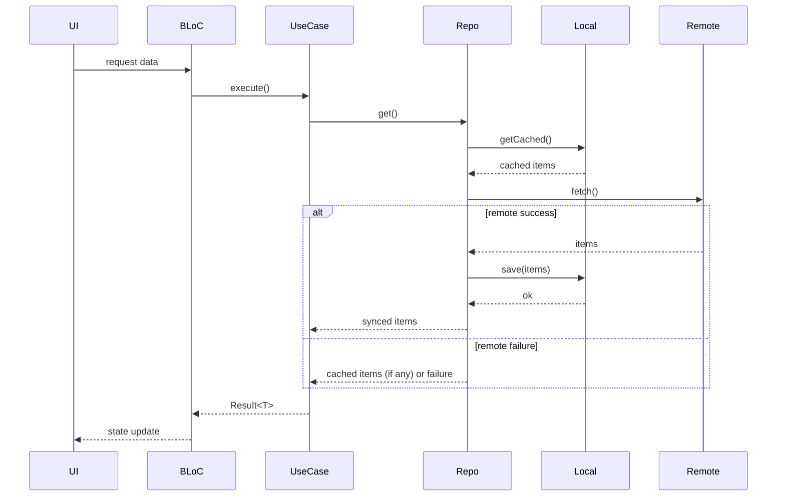

# Architecture Guide

## High-level approach

The project uses a pragmatic Clean Architecture style:

- `presentation`: UI + BLoC state management
- `domain`: entities, repository contracts, use cases
- `data`: repository implementations, local/remote datasources, models

The app is local-first for core feature data (campaigns, coupons, loyalty, notifications):

1. Load cached local data.
2. Try remote sync.
3. Update local DB.
4. Return synced data, or fallback to cache on remote failure.

## Workspace packages

Defined in root `pubspec.yaml` workspace:

- `packages/app_core`
  - `Result`, `Either`, `Failure`, `Exception`, `UseCase`, `ResultBloc`
- `packages/app_logger`
  - `talker` wrapper, scoped logger, logger mixin
- `packages/app_network`
  - `ApiClient`, `DioFactory`, auth interceptor, token store contracts/impl
- `packages/app_storage`
  - `SharedPreferencesService`, `SecureStorageService`
- `packages/app_ui_kit`
  - shared theme/tokens

## App structure

```text
lib/
  app/
    bootstrap/
    config/
    di/
      modules/
    router/
    auth/access/
  core/
    database/
  features/
    <feature>/
      data/
      di/
      domain/
      presentation/
```

## Diagrams

- Strategy: `docs/diagrams/strategy.mmd`
- Structure: `docs/diagrams/structure.mmd`
- Architecture: `docs/diagrams/architecture.mmd`
- Auth access control: `docs/diagrams/auth_access.mmd`
- Config + bootstrap: `docs/diagrams/config_bootstrap.mmd`
- Bootstrap flow: `docs/diagrams/bootstrap_flow.mmd`
- Local-first sync: `docs/diagrams/local_first_sync.mmd`

### Strategy



### Structure



### Bootstrap flow



### Architecture



### Auth Access Control



### Config And Bootstrap



### Local-First Sync



## Dependency direction

Allowed direction inside a feature:

- `presentation -> domain`
- `data -> domain`
- `domain -> (none of data/presentation)`

Cross-feature coupling should be avoided. Shared cross-cutting concerns should go through `app_core`, `app_logger`, `app_network`, `app_storage`, or a dedicated reusable package.

Localization is handled via Flutter gen-l10n; see `docs/localization.md`.

## Startup lifecycle

Entry points call `bootstrap(...)`.

Critical startup tasks:

- `configureDependencies(...)`

Deferred/conditional startup tasks:

- `seedLocalSampleData()` based on config

Startup is wrapped with `runZonedGuarded`, and framework/platform errors are logged through `StartupLogger` + `AppLogger`.

## Configuration precedence

Runtime config values are resolved in this order:

1. `--dart-define`
2. `.env` (via `envied`)
3. built-in defaults in `AppConfig`

This keeps CI/release overrides explicit while allowing local contributor setup from `.env`.

## Dependency injection

`get_it` is orchestrated from `lib/app/di/injection_container.dart`.

Registrations are split into modules:

- app-level modules in `lib/app/di/modules/` (core, network, router)
- feature-level modules in `lib/features/<feature>/di/<feature>_module.dart`

Key conventions:

- `injection_container.dart` should only create module list + execute module `register(...)`
- each feature owns its DI graph in its own module file
- keep registration order stable: core -> network -> auth -> features -> router

`AuthBloc` is a lazy singleton and receives `AppStarted` during DI setup.

## Error and result handling

Use `Result<T>` from `app_core` for use case/repository outputs.

- success: `Result.success(data)`
- failure: `Result.failure(Failure)`

Map unexpected errors with `FailureMapper.from(error)`.

UI BLoCs use `ResultBloc.executeResult(...)` to standardize loading/success/failure transitions.

## Logging

Use `LoggerMixin` + `LogContext` in repositories/BLoCs.

Example context tags:

- `AuthRepo`
- `AuthBloc`
- `CampaignRepo`

This keeps logs searchable and consistent across modules.

In development environment, Talker DevTools UI is available at `/devtools/logs`
from the More tab for runtime log inspection.
